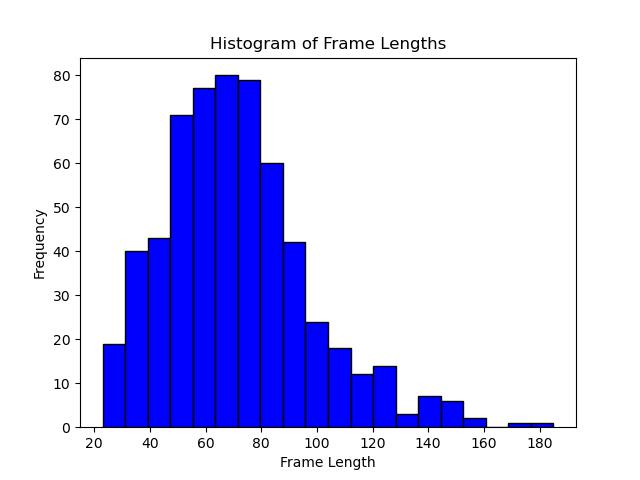

# SNN-PlanarRecon
Implementation of plane recognition using a spiking neural network

The scope of this project is an alternative implementation of a digital network using SNN's for the same task.

Starting out, its vital to be able to get a simple classifier working using the SNN network, so the KTH dataset is used as a base.

Currently, the best accuracy on the test-set is 40%, which is not satisfactory enough. Once the accuracy gets to ~80-90%, we can start transforming the problem into a ground plane estimation one.

RecurrentSNN - 40%, 30 epochs
RecurrentSNN + topk + attention - 63%, 30 epochs

Example confusion matrix:

['walking', 'jogging', 'running', 'boxing', 'handwaving', 'handclapping']

[[14  3  3  0  0  0] 
 [ 7  2  8  0  0  0] 
 [ 2  5 12  0  0  0] 
 [ 1  0  1 14  4  0] 
 [ 1  0  2  2 12  2] 
 [ 0  0  1  3  1 12]] 
Test Accuracy: 58.93%

We can see the network has a hard time classifying jogging people. It is putting then mostly in walking or running bucket.
One can theorize that the 5x5 filters do not have a large enough receptive field to capture this motion in the 120x160 resolution frames

It seems like thresholding the difference yields faster training time, but convergeance to the same value.

Example on sequence length after prprocessing:

TODO:

Adjust cache to contain information about parameters that created the lengths:

frame_skip
transform
use_diff
threshold

If these parameters are not the same, the preprocessing will not be the same, which means that we need to redo the cache.

Adjust samping on a class-basis in order to remove the temporal bias (predictions made from context length)

Use first N frames to understand an area of movement, crop the movement only while tracking any movement of the area

----------------------------

The project is currently discontinued due to the fact that the spiking neurons in the snnTorch library do not provide a realistic approach to SNN's.
When only the activations are spiking, we are still required to provide a global receptive field to the algoritm. This in my opinion slightly defeats the purpose.
The point of SNN's is to allow for sparse compute on neuromorphic hardware, this solution does not do that.

In order for the project to move on, we need to find a different library for SNN estimation.